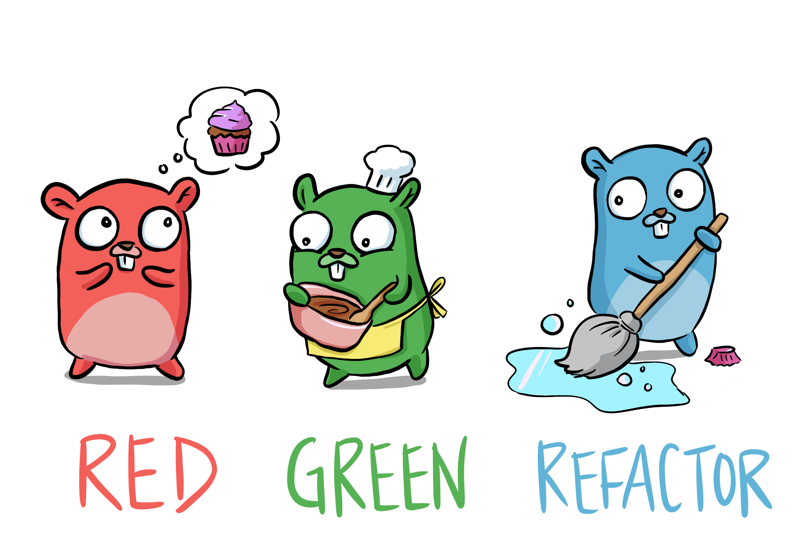

# Go com TDD

[GitBook](https://larien.gitbook.io/aprenda-go-com-testes/)

## ⚡️ Conteúdo ⚡️
|                Módulo                |                                                         URL                                                         |
|:-------------------------------------|---------------------------------------------------------------------------------------------------------------------|
| ✅ Instalação do GO                 | [**Link**](https://larien.gitbook.io/aprenda-go-com-testes/primeiros-passos-com-go/instalacao-do-go)                |
| ✅ Olá, Mundo                       | [**Link**](https://larien.gitbook.io/aprenda-go-com-testes/primeiros-passos-com-go/ola-mundo)                       |
| ✅ Inteiros                         | [**Link**](https://larien.gitbook.io/aprenda-go-com-testes/primeiros-passos-com-go/inteiros)                        |
| ✅ Iteração                         | [**Link**](https://larien.gitbook.io/aprenda-go-com-testes/primeiros-passos-com-go/iteracao)                        |
| ✅ Arrays e Slices                  | [**Link**](https://larien.gitbook.io/aprenda-go-com-testes/primeiros-passos-com-go/arrays-e-slices)                 |
| ❌ Estrutura, Métodos e Interfaces  | [**Link**](https://larien.gitbook.io/aprenda-go-com-testes/primeiros-passos-com-go/estruturas-metodos-e-interfaces) |
| ❌ Ponteiros e Erros                | [**Link**](https://larien.gitbook.io/aprenda-go-com-testes/primeiros-passos-com-go/ponteiros-e-erros)               |
| ❌ Maps                             | [**Link**](https://larien.gitbook.io/aprenda-go-com-testes/primeiros-passos-com-go/maps)                            |
| ❌ Injeção de Depenência            | [**Link**](https://larien.gitbook.io/aprenda-go-com-testes/primeiros-passos-com-go/injecao-de-dependencia)          |
| ❌ Mocks                            | [**Link**](https://larien.gitbook.io/aprenda-go-com-testes/primeiros-passos-com-go/mocks)                           |
| ❌ Concorrência                     | [**Link**](https://larien.gitbook.io/aprenda-go-com-testes/primeiros-passos-com-go/concorrencia)                    |
| ❌ Select                           | [**Link**](https://larien.gitbook.io/aprenda-go-com-testes/primeiros-passos-com-go/select)                          |
| ❌ Reflexão                         | [**Link**](https://larien.gitbook.io/aprenda-go-com-testes/primeiros-passos-com-go/reflection)                      |
| ❌ Sync                             | [**Link**](https://larien.gitbook.io/aprenda-go-com-testes/primeiros-passos-com-go/sync)                            |
| ❌ Contexto                         | [**Link**](https://larien.gitbook.io/aprenda-go-com-testes/primeiros-passos-com-go/contexto)                        |

## ⚡️ Criando uma Aplicação ⚡️
|               Módulo               |                                                URL                                                |
|:-----------------------------------|---------------------------------------------------------------------------------------------------|
| ❌ Introdução                     | [**Link**](https://larien.gitbook.io/aprenda-go-com-testes/criando-uma-aplicacao/introducao)       |
| ❌ Servidor HTTP                  | [**Link**](https://larien.gitbook.io/aprenda-go-com-testes/criando-uma-aplicacao/servidor-http)    |
| ❌ JSON, Roteamento e Aninhamento | [**Link**](https://larien.gitbook.io/aprenda-go-com-testes/criando-uma-aplicacao/json)             |
| ❌ IO e Sorting                   | [**Link**](https://larien.gitbook.io/aprenda-go-com-testes/criando-uma-aplicacao/io)               |
| ❌ CLI e Estrutura de Pacotes     | [**Link**](https://larien.gitbook.io/aprenda-go-com-testes/criando-uma-aplicacao/linha-de-comando) |
| ❌ Tempo                          | [**Link**](https://larien.gitbook.io/aprenda-go-com-testes/criando-uma-aplicacao/time)             |
| ❌ WebSockets                     | [**Link**](https://larien.gitbook.io/aprenda-go-com-testes/criando-uma-aplicacao/websockets)       |
